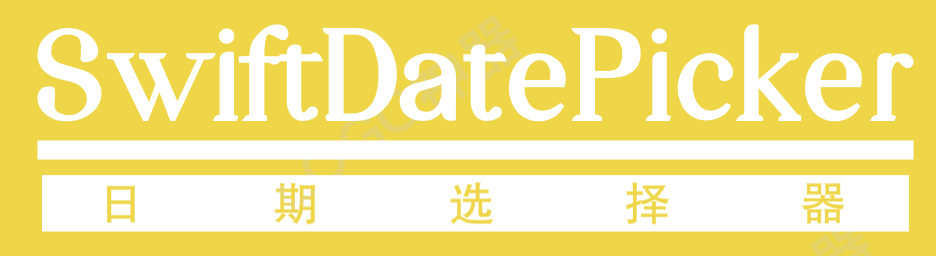
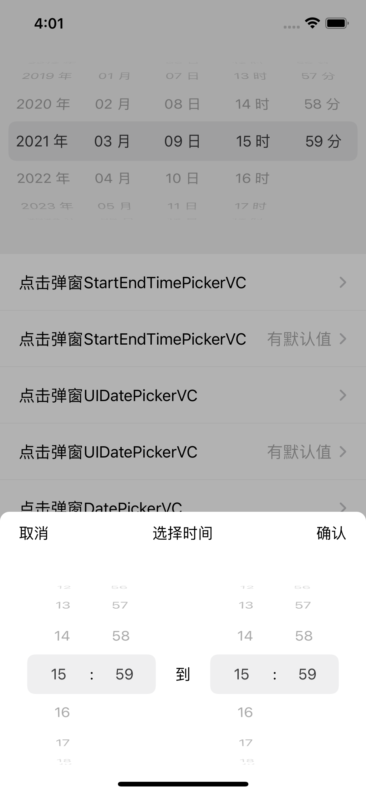
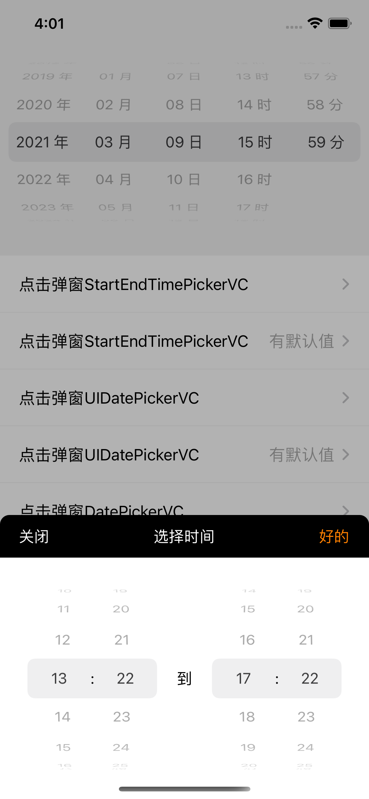
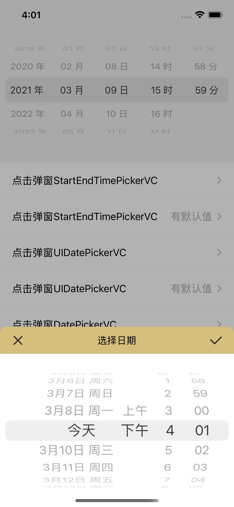
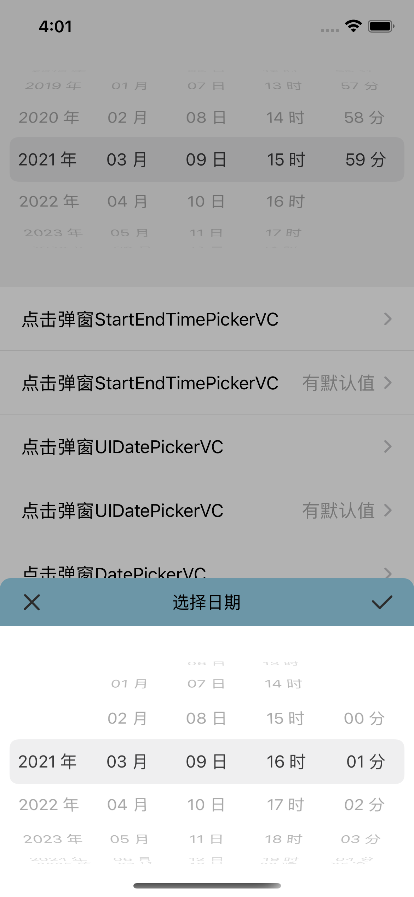
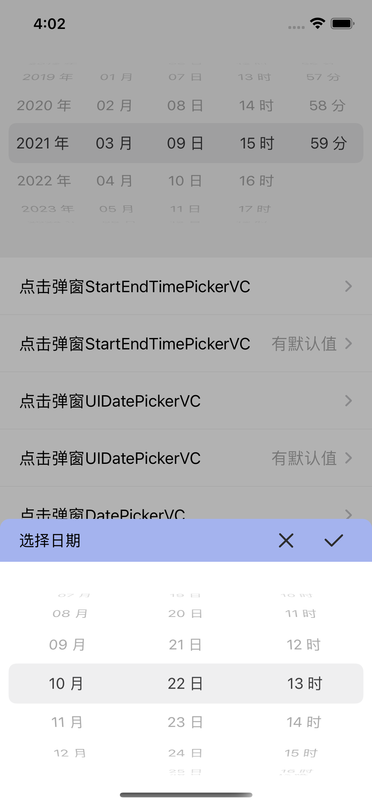

[](http://cocoapods.org/pods/SwiftDatePicker)
[](https://swift.org/package-manager/)


日期滚轮，可直接添加view，也可弹窗，有多种样式可以选择。直接闭包返回选定Date。

依赖[SwiftShow](https://github.com/jackiehu/SwiftShow)

| 选择时间间隔--默认时间（当前） | 选择时间间隔--包含上轮选定时间 | 系统Picker选择日期--默认时间     |
| ------------------------------ | ------------------------------ | -------------------------------- |
|                |                |                  |
| 系统Picker选择日期--选定时间   | 自定义Picker--默认时间         | 自定义Picker--选定时间--更改标题 |
|                |                |                  |


## 安装

### Cocoapods

1.在 Podfile 中添加 `pod ‘SwiftDatePicker’`  

2.执行 `pod install 或 pod update`

3.导入 `import SwiftDatePicker`

### Swift Package Manager

从 Xcode 11 开始，集成了 Swift Package Manager，使用起来非常方便。SwiftDatePicker 也支持通过 Swift Package Manager 集成。

在 Xcode 的菜单栏中选择 `File > Swift Packages > Add Pacakage Dependency`，然后在搜索栏输入

`https://github.com/jackiehu/SwiftDatePicker`，即可完成集成。

### 手动集成

SwiftDatePicker 也支持手动集成，只需把Sources文件夹中的SwiftDatePicker文件夹拖进需要集成的项目即可

## 用法

#### 添加View

初始化View，并添加

```swift
        let pick = DatePickerView(type: .pickerDateHourMinute, minYear: 1999, maxYear: 2030) { (date) in
            print("\(date)")
        }

        view.addSubview(pick)
        pick.snp.makeConstraints { (m) in
            m.left.right.equalToSuperview()
            m.top.equalToSuperview().offset(50)
            m.height.equalTo(200)
        }
```

API

```swift
    /// 初始化DatePickerView
    /// - Parameters:
    ///   - type: DatePickerStyle样式
    ///   - selectDate: 已选定时间
    ///   - minYear: 滚轮最小年份(不需要选择年费可不加)
    ///   - maxYear: 滚轮最大年份(不需要选择年费可不加)
    ///   - showUnit: 是否显示单位(年月日等)
    ///   - callBack: 回调Date
    public convenience init(type: DatePickerStyle,
                            selectDate: Date = Date(),
                            minYear: Int = Date().getYear(),
                            maxYear: Int = Date().getYear() + 5,
                            showUnit: Bool = true,
                            callBack: @escaping PickerClosure)
```


### 弹窗

直接调用静态方法即可

```swift
        DatePickerVC.showPicker(pickerType: .pickerMonthDayHour) { (bar) in
            bar.titleString = "选择日期"
            bar.barStyle = .titleLeft
            bar.barColor = .orange
            bar.leftNorImage = UIImage(named: "image_cancle")
            bar.rightNorImage = UIImage(named: "image_done")
            bar.leftWidth = 40
            bar.rightWidth = 40
        } dateCallBack: { (date) in
            print("\(String(describing: date))")
        } dismissCallBack: {
            print("close")
        }
```

API

```swift
    /// 弹出UIDatePickerVC
    /// - Parameters:
    ///   - mode: UIDatePicker.Mode 系统UIDatePicker的样式
    ///   - selectDate: 已选定时间
    ///   - headConfig: 顶部Bar适配器回调
    ///   - dateCallBack: 选择日期回调
    ///   - dismissCallBack: 收起视图回调
    public static func showPicker(mode: UIDatePicker.Mode,
                                  selectDate: Date = Date(),
                                  headConfig: HeadBarConfig,
                                  dateCallBack: @escaping PickerClosure,
                                  dismissCallBack: @escaping CloseClosure)
```

```swift
    /// 弹出自定义DatePickerVC
    /// - Parameters:
    ///   - pickerType: DatePickerStyle的样式
    ///   - selectDate: 已选定时间
    ///   - headConfig: 顶部Bar适配器回调
    ///   - dateCallBack: 选择日期回调
    ///   - dismissCallBack: 收起视图回调
    public static func showPicker(pickerType: DatePickerStyle = .pickerDate,
                                  selectDate: Date = Date(),
                                  headConfig: HeadBarConfig,
                                  dateCallBack: @escaping PickerClosure,
                                  dismissCallBack: @escaping CloseClosure)
```

```swift
    /// 弹出选择起始+结束时间
    /// - Parameters:
    ///   - startDate: 已选定开始时间
    ///   - endDate: 已选定结束时间
    ///   - headConfig: 顶部Bar适配器回调
    ///   - dateCallBack: 选择日期回调
    ///   - dismissCallBack: 收起视图回调
    public static func showPicker(startDate: Date = Date(),
                                  endDate: Date = Date(),
                                  headConfig: HeadBarConfig,
                                  dateCallBack: @escaping TimeIntervalClosure,
                                  dismissCallBack: @escaping CloseClosure)
```


Bar适配器

```swift
public class HeadBar {
    ///bar样式 标题居中/标题居左
    public var barStyle: BarStyle = .titleCenter
    ///bar背景色
    public var barColor: UIColor?
    ///bar高度
    public var barHeight: CGFloat?
    ///bar标题字体
    public var titleFont: UIFont?
    ///bar按钮字体
    public var buttonFont: UIFont?
    ///bar标题
    public var titleString: String?
    ///bar左按钮标题
    public var leftString: String?
    ///bar右按钮标题
    public var rightString: String?
    ///bar左按钮图片
    public var leftNorImage: UIImage?
    ///bar右按钮图片
    public var rightNorImage: UIImage?
    ///bar左按钮按下图片
    public var leftHigImage: UIImage?
    ///bar右按钮按下图片
    public var rightHigImage: UIImage?
    ///bar标题字体颜色
    public var barTitleColor: UIColor?
    ///bar左按钮字体颜色
    public var leftNorColor: UIColor?
    ///bar右按钮字体颜色
    public var rightNorColor: UIColor?
    ///bar左按钮按下字体颜色
    public var leftHigColor: UIColor?
    ///bar右按钮按下字体颜色
    public var rightHigColor: UIColor?
    ///bar左按钮宽度
    public var leftWidth: CGFloat?
    ///bar右按钮宽度
    public var rightWidth: CGFloat?
}
```

全局DatePicker适配器（静态）

```swift
///DatePicker适配器
public struct DatePicker {
    ///滚轮内字体
    public static var pickerFont: UIFont?
    ///滚轮内字体颜色
    public static var pickerTextColor: UIColor?
    ///滚轮整体背景色
    public static var pickerBackColor: UIColor?
    
    ///滚轮宽度
    public static var pickerWidth: CGFloat?
    ///滚轮高度
    public static var pickerHeight: CGFloat?
    ///滚轮最小年
    public static var minYear: Int?
    ///滚轮最大年
    public static var maxYear: Int?
}
```


## 更多砖块工具加速APP开发

[](https://github.com/jackiehu/SwiftBrick)

[](https://github.com/jackiehu/SwiftMediator)

[](https://github.com/jackiehu/SwiftShow)

[](https://github.com/jackiehu/SwiftLog)

[](https://github.com/jackiehu/SwiftyForm)

[](https://github.com/jackiehu/SwiftEmptyData)

[](https://github.com/jackiehu/SwiftPageView)

[](https://github.com/jackiehu/JHTabBarController)

[](https://github.com/jackiehu/SwiftMesh)

[](https://github.com/jackiehu/SwiftNotification)

[](https://github.com/jackiehu/SwiftNetSwitch)

[](https://github.com/jackiehu/SwiftButton)

