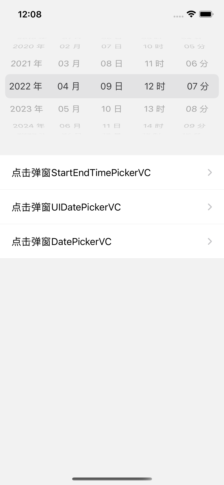
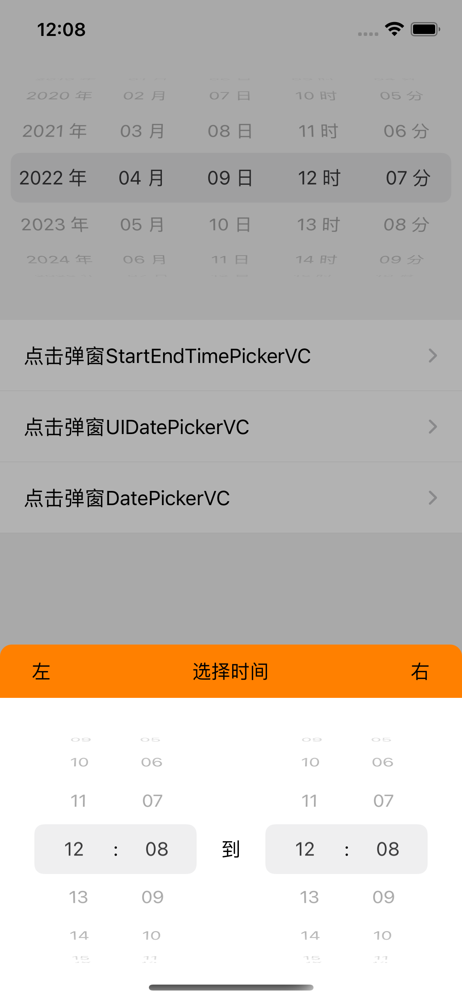
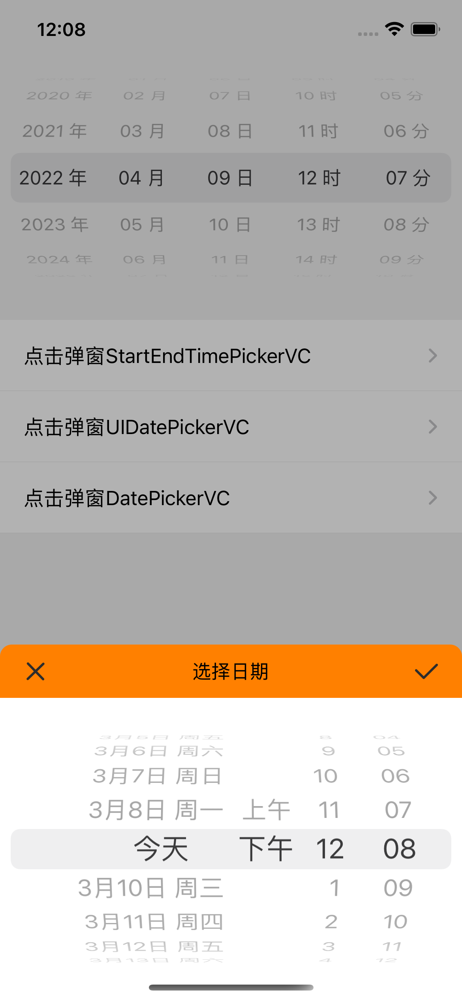
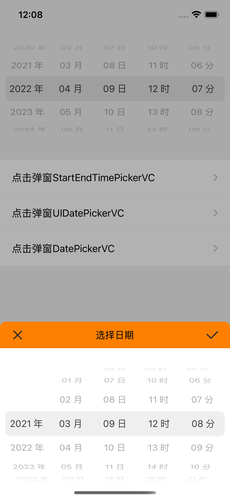
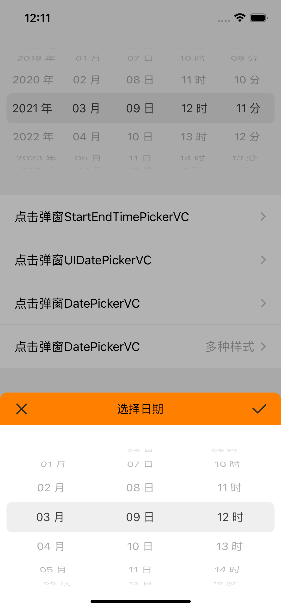
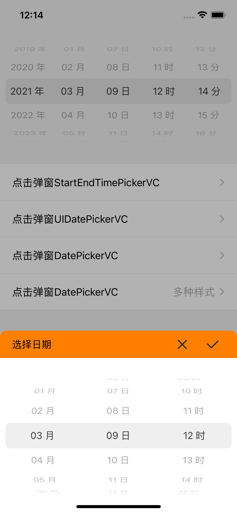

# SwiftDatePicker
日期滚轮，可直接添加view，也可弹窗，有多种样式可以选择。直接闭包返回选定Date。依赖SwiftShow

### [SwiftShow](https://github.com/jackiehu/SwiftShow)

|  |  |  |
| ---------- | ---------- | ---------- |
|  |  |  |

## 用法

#### 添加View

初始化View，并添加

```swift
        let pick = DatePickerView(type: .pickerDateHourMinute, minYear: 1999, maxYear: 2030) { (date) in
            print("\(date)")
        }

        view.addSubview(pick)
        pick.snp.makeConstraints { (m) in
            m.left.right.equalToSuperview()
            m.top.equalToSuperview().offset(50)
            m.height.equalTo(200)
        }
```

API

```swift
    /// 初始化DatePickerView
    /// - Parameters:
    ///   - type: DatePickerStyle样式
    ///   - minYear: 滚轮最小年份(不需要选择年费可不加)
    ///   - maxYear: 滚轮最大年份(不需要选择年费可不加)
    ///   - showUnit: 是否显示单位(年月日等)
    ///   - callBack: 回调Date
    public convenience init(type: DatePickerStyle,
                            minYear: Int = Date().getYear(),
                            maxYear: Int = Date().getYear() + 5,
                            showUnit: Bool = true,
                            callBack: @escaping PickerClosure)
```


### 弹窗

直接调用静态方法即可

```swift
        DatePickerVC.showPicker(pickerType: .pickerMonthDayHour) { (bar) in
            bar.titleString = "选择日期"
            bar.barStyle = .titleLeft
            bar.barColor = .orange
            bar.leftNorImage = UIImage(named: "image_cancle")
            bar.rightNorImage = UIImage(named: "image_done")
            bar.leftWidth = 40
            bar.rightWidth = 40
        } dateCallBack: { (date) in
            print("\(String(describing: date))")
        } dismissCallBack: {
            print("close")
        }
```

API

```swift
    /// 弹出UIDatePickerVC
    /// - Parameters:
    ///   - mode: UIDatePicker.Mode 系统UIDatePicker的样式
    ///   - headConfig: 顶部Bar适配器回调
    ///   - dateCallBack: 选择日期回调
    ///   - dismissCallBack: 收起视图回调
    public static func showPicker(mode: UIDatePicker.Mode,
                                  headConfig: HeadBarConfig,
                                  dateCallBack: @escaping PickerClosure,
                                  dismissCallBack: @escaping CloseClosure)
```

```swift
    /// 弹出自定义DatePickerVC
    /// - Parameters:
    ///   - pickerType: DatePickerStyle的样式
    ///   - headConfig: 顶部Bar适配器回调
    ///   - dateCallBack: 选择日期回调
    ///   - dismissCallBack: 收起视图回调
    public static func showPicker(pickerType: DatePickerStyle = .pickerDate,
                                  headConfig: HeadBarConfig,
                                  dateCallBack: @escaping PickerClosure,
                                  dismissCallBack: @escaping CloseClosure)
```

```swift
    /// 弹出选择起始+结束时间
    /// - Parameters:
    ///   - headConfig: 顶部Bar适配器回调
    ///   - dateCallBack: 选择日期回调
    ///   - dismissCallBack: 收起视图回调
    public static func showPicker(headConfig: HeadBarConfig,
                                  dateCallBack: @escaping TimeIntervalClosure,
                                  dismissCallBack: @escaping CloseClosure)
```


## 安装

#### cocoapods导入

```ruby
pod 'SwiftDatePicker'
```

#### SPM导入

`https://github.com/jackiehu/SwiftDatePicker`

#### 手动导入